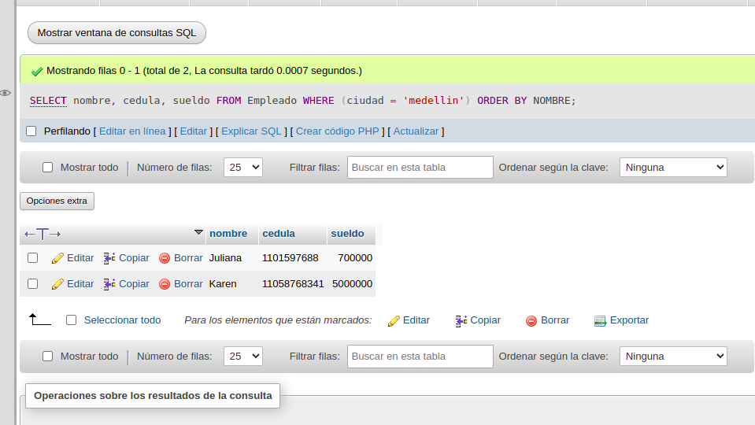
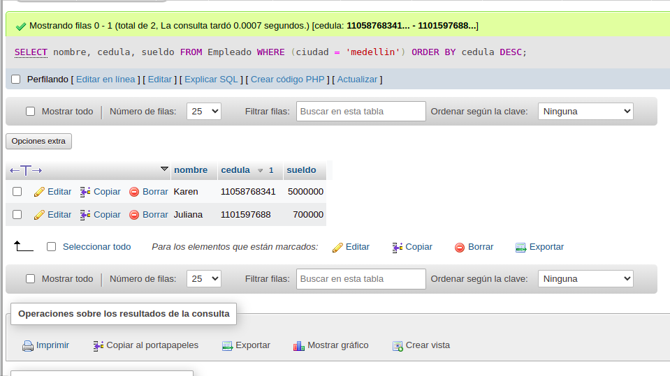
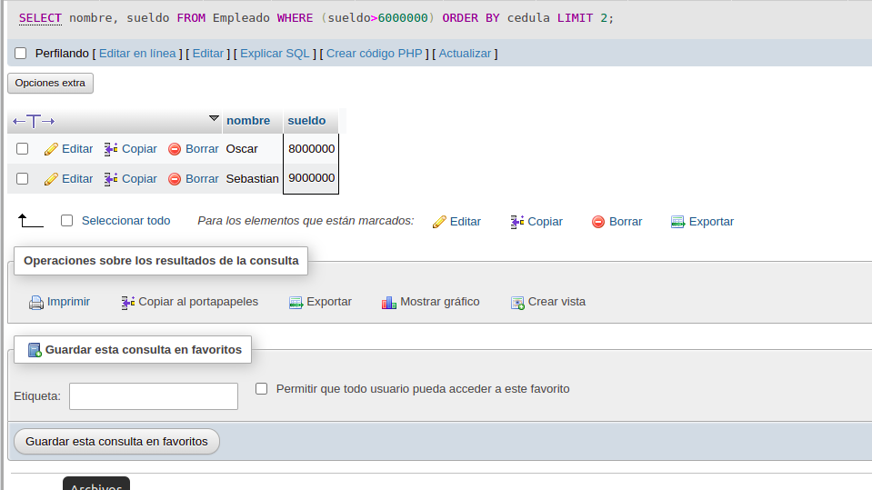
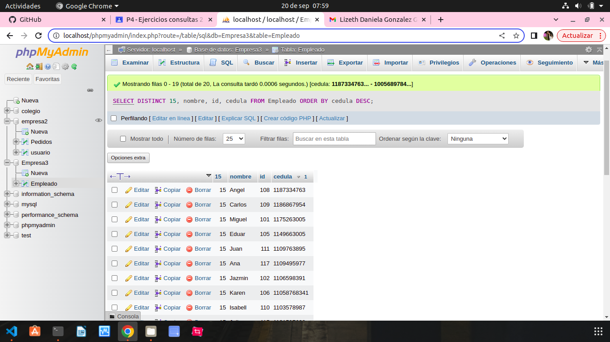
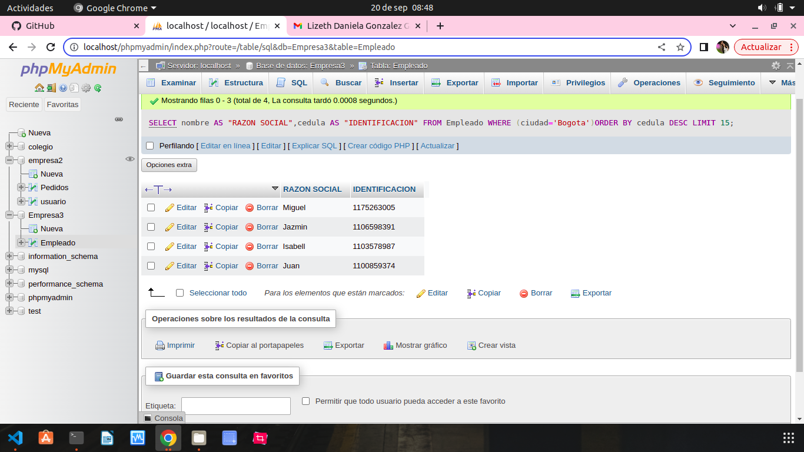
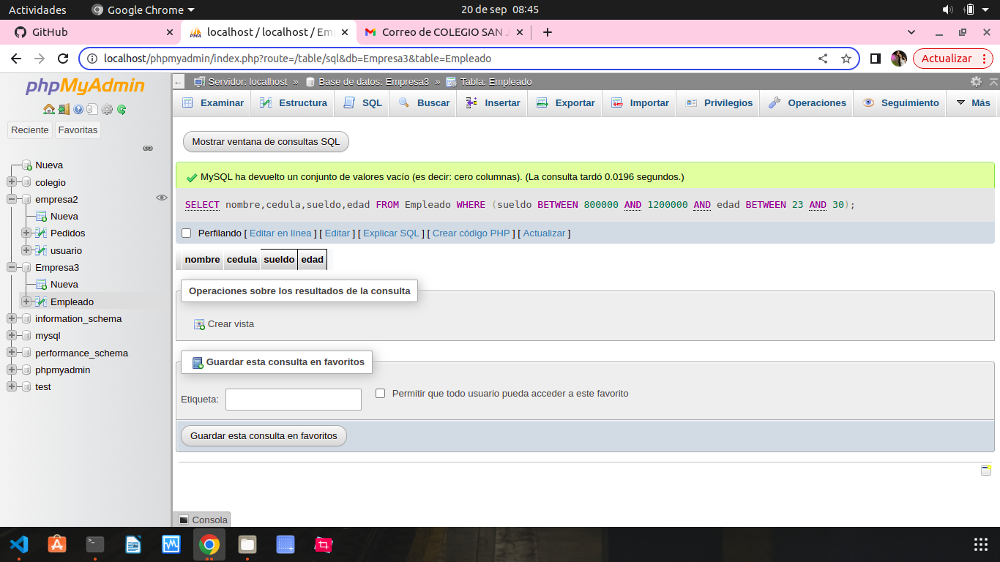
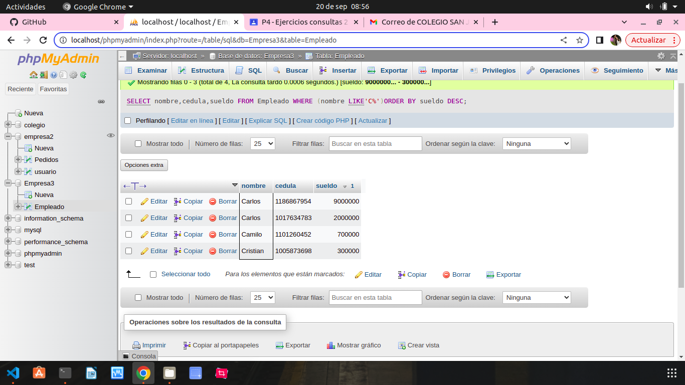

1. Traer el nombre, Cedula y Salario de un empleado, ordenando, los campos de las siguiente manera: Ascendente por nombre y descendentes por cedula.

`SELECT NOMBRE, CEDULA, SUELDO FROM EMPLEADOS WHERE (CUIDAD='MEDELLIN') ORDER BY NOMBRE`

2. Traer el nombre y el salario de los primeros 25 empleados cuyo sueldo es mayor de $6000000 ordenandolos en forma ascendente por el numero de cedula.

`SELECT TOP 25 NOMBRE, SUELDO FROM EMPLEADOS WHERE (SUELDO>6000000)ORDERNBY CEDULA`

3. Mostrar el nombre,id y cedula de los primeros 15 empleados cuyos nombres sea distintos. Orden la consulta en forma descenente por cedula. 

SELECT DISTINCT TOP 15 NOMBRE,ID,CEDULA FROM EMPLEADOS ORDEN BY CEDULA DESC;

4. Entregar los primeros 15 empleados con nombre y cedula cuya ciudad sea BOGOTA. Se necesita que los encabezados de las columnas tengan los siguientes titulos: 

a. Para el campo NOMBRE -------RAZON SOCIAL 
b. Para el campo CEDULA -------IDENTIFICACION 
c. Ordene la lista en forma descendente por cedula 

`SELECT TOP 15 NOMBRES AS "RAZON SOCIAL", CEDULA AS "IDENTIFICACION" FROM EMPLEADOS WHERE (CIUDAD='BOGOTA')ORDER BY CEDULA DESC`

5. Realizar una consulata que entregue el nombre, identifacacion, sueldo, edad de los empleados cuyos sueldos esten entre $800000 y $1200000 y cuyas edades esten entre los 23 y 30 años.

`SELECT NOMBRE, CEDULA, SUELDO, EDAD FROM EMPLEADOS WHERE (SUELDO BETWEEN 800000 AND 1200000 AND EDAD BETWEEN 23 AND 30`

6. Realizar una conslta que muestre nombre, cedula y salario de los empleados cuyo nombre comience por la letra c.ordene esta lista por salarioen forma descendente.

`SELECT NOMBRE,CEDULA,SUELDO FROM EMPLEADOS WHERE (NOMBRE LIKE'C%')ORDER BY SUELDO DESC`

